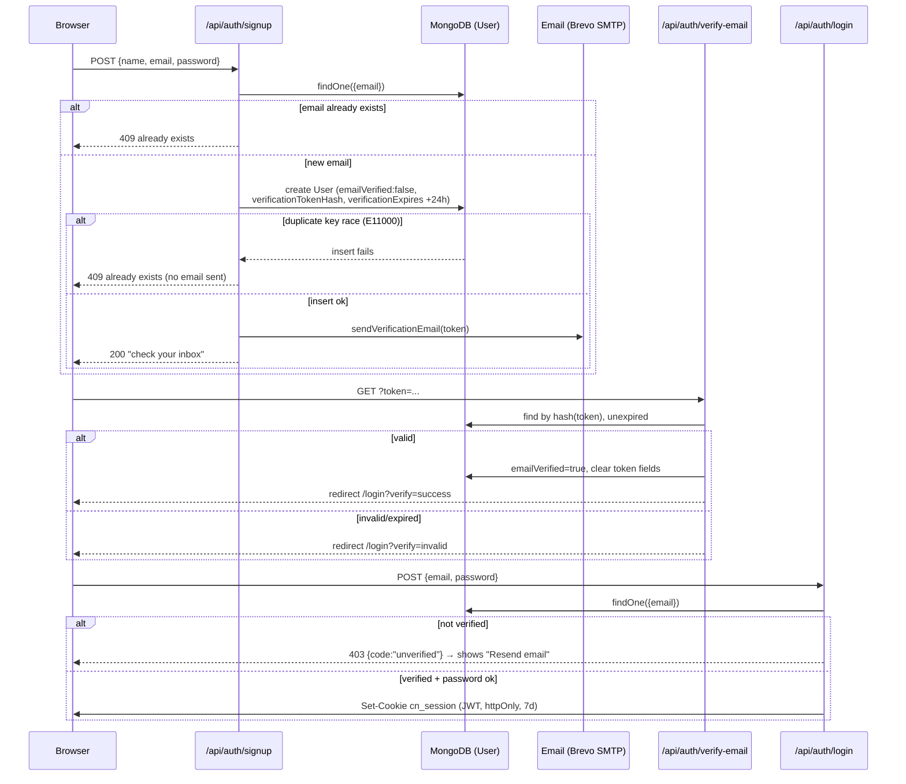
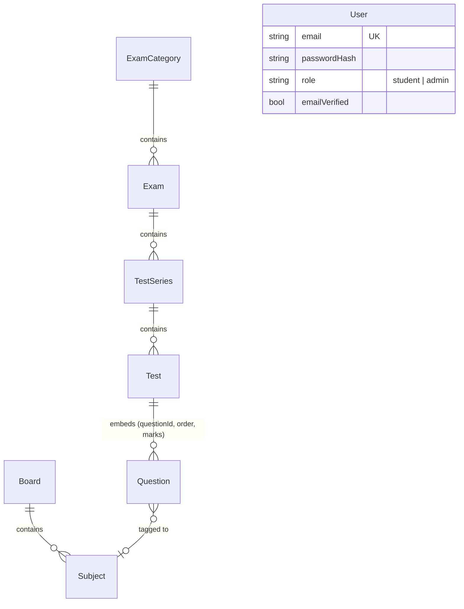

# VR TEST BATCH — App Flow

This documents the app as it exists in the code today (routes, auth, data model, admin CRUD). It is a snapshot, not a plan — update it when routes/models change.

## 1. Route map

```
app/
├─ (auth)/                      # centered card layout, no session required
│  ├─ login/
│  ├─ signup/
│  ├─ forgot-password/
│  └─ reset-password/
├─ (public)/                    # SiteHeader + SiteFooter
│  ├─ page.tsx                  # home
│  ├─ exams/
│  ├─ test-series/
│  ├─ tests/
│  ├─ current-affairs/
│  └─ results/
├─ dashboard/                   # AppShell (student), NOT gated at layout level
│  ├─ page.tsx                  # overview/stats
│  ├─ tests/
│  ├─ results/
│  ├─ bookmarks/
│  └─ profile/
├─ admin/
│  ├─ login/                    # standalone, outside the protected group
│  └─ (protected)/              # AppShell (mono theme), NOT gated at layout level
│     ├─ dashboard/
│     ├─ exams/ (+ categories/)
│     ├─ syllabus/ (boards; + subjects/)
│     ├─ questions/
│     ├─ test-series/
│     ├─ tests/ (+ [id]/questions)
│     ├─ users/
│     └─ reports/
└─ api/
   ├─ auth/                     # signup, login, admin-login, logout, me,
   │                             # verify-email, forgot-password, reset-password,
   │                             # resend-verification
   ├─ admin/                    # boards, subjects,
   │                             # exam-categories, exams, questions, test-series,
   │                             # tests (+ tests/[id]/questions), users
   └─ (top-level)                # attempts, exam-cycles, exams, leaderboard,
                                  # payments, questions, results, subscriptions,
                                  # syllabus, test-series, tests, users
                                  # → all stubs: {status:"not_implemented"}
```

There is no `middleware.ts`. Route protection happens **inside each API handler** via `requireAdmin()` / `requireUser()` (see below) — page-level layouts render regardless of session and only use it to display a name.

## 2. Auth flow



- Passwords: bcrypt, cost 12 ([src/lib/auth/password.ts](src/lib/auth/password.ts)).
- Verification/reset tokens: random 32-byte hex sent to the user; only the SHA-256 hash is stored ([src/lib/auth/tokens.ts](src/lib/auth/tokens.ts)) — a DB leak alone can't be replayed.
- Session: JWT (`jose`, HS256, `AUTH_SECRET`) with `{sub, role, name, email}`, cookie `cn_session` ([src/lib/auth/session.ts](src/lib/auth/session.ts)).
- Admin login (`/api/auth/admin-login`) is the same flow with an added `role === "admin"` check.
- Guards ([src/lib/auth/guard.ts](src/lib/auth/guard.ts)): `requireAdmin()` / `requireUser()` read the session and return a `401 NextResponse` on failure, called as the first line of every protected route handler — not middleware.

## 3. Data model



Two independent hierarchies meet at `Question`: the **exam hierarchy** (ExamCategory → Exam → TestSeries → Test) that a student attempts, and the **syllabus hierarchy** (Board → Subject) that classifies each question. `attempts`, `results`, `leaderboard`, `subscriptions`, `payments`, `notifications` only have `index.ts` placeholders — no models yet, matching their stub API routes.

## 4. Admin CRUD flow

Most `/api/admin/*` resources are generated by one factory, [src/lib/api/crud.ts](src/lib/api/crud.ts) — `crudHandlers(model, createSchema, updateSchema, {searchFields, populate})` — producing list/create/get/update/delete handlers that each start with:

```ts
const guard = await requireAdmin();
if (guard) return guard;
```

before touching the DB. It supports pagination (`page`, `limit` ≤ 200), regex search (`q` over `searchFields`), equality filters from other query params, and optional `.populate()`.

`users` and `tests/[id]/questions` are hand-written (not through the factory) but follow the same guard-first pattern. Admin-created users skip email verification (`emailVerified: true` on creation).

## 5. Navigation shell

- `components/layout/site-header.tsx` — public marketing header; desktop nav inline, mobile nav as a full conditional slide-in panel (`{open ? <div>...</div> : null}`).
- `components/layout/app-shell.tsx` + `sidebar-nav.tsx` — shared shell for `/dashboard/*` and `/admin/(protected)/*`; sidebar is `fixed` + translate-toggled below `lg`, `static` at `lg`+.
- `components/auth/logout-button.tsx` — posts to `/api/auth/logout`, then redirects to a caller-supplied path (`/login` for dashboard, `/admin/login` for admin).
